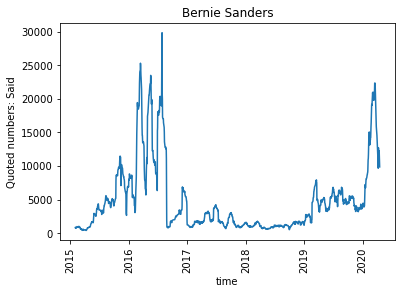
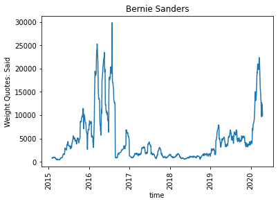

# Can Quotations of Politicians Indicate Election Results?

[**View Code on Github**](https://github.com/epfl-ada/ada-2021-project-chilldatagroup.git)

## Introduction:

In general, more quotations in news articles indicate more popularity or at least more exposure to the public. Quotations could thereby be vital for the successful careers of politicians. On the other hand, successful politicians are also more frequently quoted in news. **Thus, the career of politicians may be highly correlated with quotations.** The recent release of QuoteBank, a corpus of quotations from news, can be useful in extracting the quotations of politicians. 

In this project, we will focus on the U.S. Senate elections. First, combining the quotations and election results, we want to answer whether more quoted senate election candidates tend to have better election results. Then, we aim to examine if quotations can be an efficient predictor of election results. Furthermore, quotations can either praise or criticize the politicians. Recent advancements in language sentiment analysis enable us to get attitudes toward quoted candidates. We will explore how such attitudes correlated with election results.

## Extract candidate quotes:

We get the senate election result from MIT Election Data and Science Lab[1]. It contains the election information of each candidate. We use the dataset to get the identity, party affiliation, and resulting votes of each candidate. We select the candidates participating in **U.S. Senate elections since 2016**. In QuoteBank corpus, we find quotations **said by** these candidates in news articles **from 2015 to 2020**. By aggregating the quotations based on candidates and dates, we may look at how the number of quotations said by a selected candidate changes over time. Let's look at an example from Bernie Sanders:

  

On the other hand, there is another type of quotation: quotations **mentioning the candidates** but not necessarily said by themselves. In QuoteBank corpus, we can also find quotations **mentioning** the Senate election candidates in news articles from 2015 to 2020. By aggregating the quotations based on candidates and dates again, we can look at how the number of quotations mentioning a selected candidate changes over time. Let's look at Bernie Sanders from this perspective:

  

(Note: Since Quotebank may extract different numbers of quotations each month, we normalize quotations in each month by the total number of quotes of that month contained in Quotebank. Detail can be found in the jupyter notebook in the GitHub repository.)

## Total quotation is positively correlated to results.

We can also calculate each candidate's total quotations before the election and compare the number of total quotations to election results. For both types of quotations, we use scatter plots to show how total quotation numbers and vote rates are related.

  

We further examine the correlation for both types of quotations by calculating the **Pearson Correlation Coefficient**. 

1. For the quotations said by the senate candidates, we have Pearson Correlation 0.61, with P-Value 3.5e-26. 
2. For the quotations mention the senate candidates, we have Pearson Correlation 0.53, with P-Value 1.1e-22.

**Senates with higher number of quotations before election tend to have higher vote rate!**

## Weigh quotes by website view of the source media

While the above finding accords with our intuition (that more quotations indicate more success), purely counting the number of quotations ignores the qualities of different quotations. In fact, a quotation in New York Times means much more fame than a quotation from a local tabloid. Therefore, we weigh each quotation by the website views of the source media.

QuoteBank, however, only provides the URL where each quote is extracted. So, we first extract the main webdomain of the URLs from 50 thousand quotations and examine the distribution of source media:

  

As we can see from the histogram, the distribution is heavy-tailed, with most quotations from a few media. We also notice that the **50 thousand quotations have over 4000 different media sources**, indicating that the set of quotations from the QuoteBank is an efficient representation of all quotations in news articles.

Since it is difficult to automatically find the website view data of all media sources, we decide to manually search the website view statistics of the **top 30 frequently appearing media**. Among the rest media, we manually search the website view statistics of **10 randomly selected media**, and then we use the **median value** (which is more robust to outlier) to weigh the quotations of the rest media. Below, we show the website view of the top 10 frequently appearing media in Quotebank.

  

Now, we can look at the weighted quotations said by Bernie Sanders:

  

We can also calculate the correlation between weighted total quotations (before the elections) and vote rate:

1. For the quotations said by the senate candidates, we have Pearson Correlation 0.62, with P-Value 1.8e-27. 
2. For the quotations mention the senate candidates, we have Pearson Correlation 0.59, with P-Value 3.4e-29.

The result is very close to the correlations between the number of quotations and vote rate. **Senates with a higher number of weighted quotations before the election also tend to have a higher vote rate!**

## Different exposure-gaining process for different politicians.

Different politicians gain public exposure in different ways. Some politicians may gain popularity through years of accumulating fame, while some others may gain overnight fame through some accidents or sponsorships from other powerful people. As a result, if we look at **the curves of how weighted quotations change before election**, we will probably see different shapes. We examine how the weighted quotations of each politician change over time, and whether there are different types of exposure-gaining processes.

To do this, we extract the weighted quotations said by each candidate **within 300 days** (roughly a year) before the election day. We then accumulate the weighted quotations **by month**, so that we get a 10-dimensional feature vector per candidate. This vector reflects how weighted quotations said by each candidate change over time. The vectors are **L2 normalized**, so that the euclidean distance between them reflects the cosine similarity, which better measures the distance between different shapes of the exposure-gaining process. We then apply **KMeans clustering** to the feature vector (K=3 has the best silhouette score). To better visualize the cluster, we use PCA to lower the dimension to 2 and label the cluster with different colors:

  

The method appears to be efficient at separating the clusters. We then look at the centroid of the three clusters and see three types of exposure gaining: politicians in type 0 have **several peaks** of quotations before the election; politicians in type 1 have **one major peak** within a month before the election; and politicians in type 2 have **one major peak** roughly 1-2 months before the election.

  

For each type, we look at one example candidate:

  

We then compare the final vote rates of politicians in those three different clusters:

  

Interestingly, politicians in type 1 appear to have significantly **higher vote rate** (t-test, p-value < 0.01). The major quotation peak right before the election may indicate that the last month is crucial in the election campaign.

## Quotations can predict election result!

We further explore if the election results can be predicted from the quotation data. We use the **monthly aggregated quotation feature vectors** used in the clustering analysis above. Besides, party affiliation can have a significant effect on the result. For senate candidates in each state's election, we find the **vote rate of their affiliated party** in the previous presidential election[2]. This party vote rate reflects the overall ideology of the state. We concatenate this voting feature to the quotation feature vectors and use this 11-dimensional vector for predicting the election result.

We get the best performance using the XGBoost classifier. First, we calculate the accuracy and precision of the training datasets by 5 fold cross-validation. Cross-Validated training accuracy is 0.79 (+/- 0.21) and cross-validated training f1 score is 0.70 (+/- 0.27). Then, we fit our model in the training data and calculate accuracy and F1 score on the test data. We obtain **accuracy 0.91 and f1 score 0.90** on the test data.

**Quotations can be used to predict election result!**

## Sentiment of quotations reflect support rate.

For quotations mentioning senate candidates, they contain attitudes (positive or negative) of the speaker toward the mentioned politicians. We can use the **VADER** sentiment analysis package to extract such attitudes. For instance, let's look at how sentiments toward Bernie Sanders changes over time.

  

To examine whether sentiments in quotations can represent support rate, we can calculate the **average sentiment score of quotations** mentioning each candidate **within a year before the election**. We discard candidates having a low vote_rate (< 1%), because they are often representatives of small parties and their quotation data are very limited. The relation can be visualized by scatter plots of average sentiment score and final vote rate:

  

The Pearson Correlation is -0.11, with a P-Value 0.03 (< 0.05), which is statistically significant. **Sentiments in the media falsely reflect the public's opinions!** Such observation seems to be contrary to the intuition that more favorable people will receive more votes. There are three possible explanations for this: 
1. The dataset of quotes mentioning candidates is limited and the correlation here is spurious. 
2. Those candidates who adopt a middle way campaign strategy will be likely to receive more votes from both sides. 
3. Media do not reflect the actual ideas of most people (which was seldomly realized by the public until Donald Trump).

## Reference:

[1]MIT Election Data and Science Lab, 2017, "U.S. Senate 1976–2020", https://doi.org/10.7910/DVN/PEJ5QU, Harvard Dataverse, V5.

[2]MIT Election Data and Science Lab, 2017, "U.S. President 1976–2020", https://doi.org/10.7910/DVN/42MVDX, Harvard Dataverse, V6.

You can use the [editor on GitHub](https://github.com/zihan-wu/SenateQuotationWeb/edit/gh-pages/index.md) to maintain and preview the content for your website in Markdown files.

Whenever you commit to this repository, GitHub Pages will run [Jekyll](https://jekyllrb.com/) to rebuild the pages in your site, from the content in your Markdown files.

